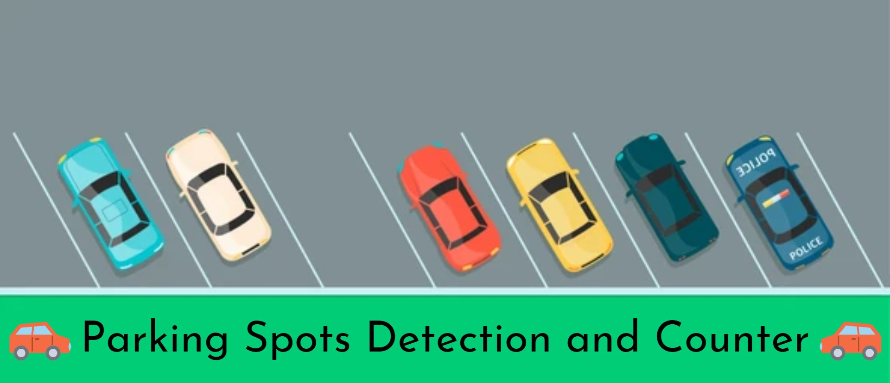
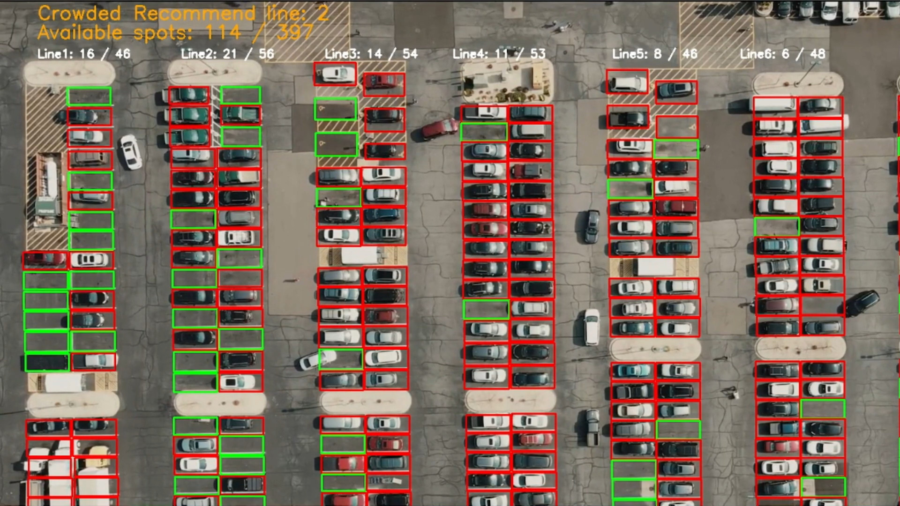

[](https://www.linkedin.com/in/%C4%91%E1%BB%A9c-v%C5%A9-6772a6248)

------------------------------------------
## Parking Spots Detection and Counter

Build a basic model and base on OpenCV **count** number of parking spots , **show status** of parking spots and each line, **recommend best line**.
### Workflow
**I.** Build **basic model** for know **each parking spot empty or not**.

**II.** Crop each parking spots by using **connected component**.

**III.** **Updated status** every 30 frames of parking spots **have great degree of change** about **mean value**. 

**III.** Merge them and use **Opencv library** to take information
### Dependencies

* Opencv
* Numpy
* Python3
* Pytorch

```python
pip install opencv       # opencv library
pip instal numpy         # numpy library
pip instal pytorch       # pytorch library
pip install torchvision  # pytorch for vision
```

**NB**: Update the libraries to their latest versions before training.

----------------------------------------
### Sample outputs
**Click** to watch full: [HERE](https://www.youtube.com/watch?v=Qw9waG-QxW0)

------------------------------------------
## How to run

⬇️⬇️**Download** and extract all my train dataset: [Parking Spots Detection Dataset](https://drive.google.com/file/d/1W8fJjf2CgFXGGm152FzC-Es2JXv8uG5K/view?usp=sharing)

⬇️⬇️**Download** pretrained model: [Model](https://drive.google.com/file/d/1SesyLBOIxiS6NJiQQipXEDx67Tl0d3_O/view)


Run the following **scripts** for training and/or testing

```python
python train.py # For training the model 
python run.py   # For view result
```

------------------------------------------

**Docker Image**
-----------
Run the following **scripts** for visual result of model:

**1.**
Download **[Docker](https://www.docker.com/)**

Open **CMD**

**2.**
Download my image

```python
docker pull vvduc1803/parking_spots:latest                                  # Pull image
```

**3.**
Copy and paste
```python
docker run -it -d --name parking_spots vvduc1803/parking_spots  # Run container
```
**4.**
Copy and paste
```python
docker run parking_spots                                            # Run visual result
```
------------------------------------------
### Todo

1. Experiments with different **learning-rate and optimizers**.
2. **Converting and optimizing** for **drone or camera** deployment.

### Authors

Van Duc